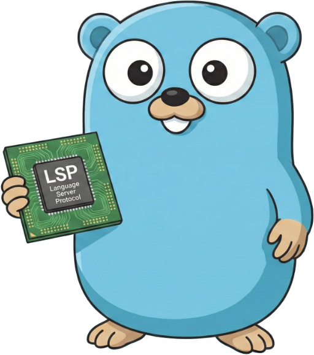

# go-lsp


[](https://microsoft.github.io/language-server-protocol/specifications/lsp/3.17/specification/)

[](https://badge.fury.io/go/github.com%2Fmodern-dev%2Fgo-lsp)
[](https://pkg.go.dev/github.com/modern-dev/go-lsp)

**A modern, generator-first Go implementation of the [Language Server Protocol](https://microsoft.github.io/language-server-protocol/) (LSP 3.17).**



`go-lsp` is a drop-in replacement for the outdated and effectively abandoned [`go.lsp.dev/protocol`](https://pkg.go.dev/go.lsp.dev/protocol). Heavily influenced by Go's own [`gopls`](https://github.com/golang/tools/tree/master/gopls) and its internal protocol package, it takes a generator-first approach: the entire type system, server/client interfaces, and JSON-RPC dispatch layer are produced directly from Microsoft's official [`metaModel.json`](https://github.com/microsoft/vscode-languageserver-node/blob/main/protocol/metaModel.json) specification. This means bumping to a future LSP version is a one-line ref change and a `go generate` - no manual type wrangling required.

## Install

```bash
go get github.com/modern-dev/go-lsp@latest
```

## Quick Start

Implement the `Server` interface (or just the methods you care about), wire it up with `ServerHandler`, and you have a working LSP server:

```go
package main

import (
    "context"
    "os"

    "github.com/modern-dev/go-lsp/protocol"
    "go.lsp.dev/jsonrpc2"
)

type myServer struct {
    // embed a base implementation or implement all 73 methods
}

func (s *myServer) Initialize(ctx context.Context, params *protocol.InitializeParams) (*protocol.InitializeResult, error) {
    return &protocol.InitializeResult{
        Capabilities: protocol.ServerCapabilities{
            HoverProvider: true,
        },
        ServerInfo: &protocol.ServerInfo{Name: "my-server"},
    }, nil
}

func (s *myServer) Hover(ctx context.Context, params *protocol.HoverParams) (*protocol.Hover, error) {
    return &protocol.Hover{
        Contents: protocol.MarkupContent{
            Kind:  protocol.MarkupKindMarkdown,
            Value: "Hello from **my-server**!",
        },
    }, nil
}

// ... implement remaining Server interface methods ...

func main() {
    server := &myServer{}
    handler := protocol.ServerHandler(server, nil)

    stream := jsonrpc2.NewStream(os.Stdin, os.Stdout)
    conn := jsonrpc2.NewConn(stream)
    conn.Go(context.Background(), handler)
    <-conn.Done()
}
```

## Migrating from `go.lsp.dev/protocol`

`go-lsp` ships a [compatibility layer](protocol/compat.go) with type and constant aliases matching the old `go.lsp.dev/protocol` v0.12.0 naming conventions. In most cases, migration is a single import path swap:

```diff
- "go.lsp.dev/protocol"
+ "github.com/modern-dev/go-lsp/protocol"
```

The compat layer covers:
- Workspace capability struct aliases (`ServerCapabilitiesWorkspace`, etc.)
- All 24 semantic token type short names (`SemanticTokenNamespace`, `SemanticTokenFunction`, …)
- All 10 semantic token modifier short names
- `MarkupKind`, `CodeActionKind`, and `FoldingRangeKind` short-form aliases

## Project Structure

```
go-lsp/
├── cmd/generate/              Generator entry point
│   └── main.go
├── internal/generate/         Generator internals
│   ├── model.go               metaModel.json data structures
│   ├── generator.go           Type resolution + Go naming
│   └── output.go              Code emission
├── protocol/                  LSP protocol package (importable)
│   ├── doc.go                 Package doc + go:generate directive
│   ├── uri.go                 DocumentURI / URI types + helpers
│   ├── logger.go              Logger interface + NopLogger
│   ├── errors.go              LSP error codes
│   ├── handler.go             ServerHandler (hand-written glue)
│   ├── compat.go              Backward-compat aliases for go.lsp.dev/protocol
│   ├── types_gen.go           [generated] All LSP types (6000+ lines)
│   ├── server_gen.go          [generated] Server interface + dispatch
│   └── client_gen.go          [generated] Client interface + dispatch
├── go.mod
└── README.md
```

## Generator

The generator reads Microsoft's `metaModel.json` — the machine-readable LSP specification — and produces three Go source files. It downloads the spec from GitHub automatically, or you can point it at a local copy.

```bash
# Re-generate from the default spec ref
go generate ./protocol/...

# Or run the generator directly
go run ./cmd/generate -o ./protocol

# Use a local metaModel.json
go run ./cmd/generate -o ./protocol -model ./path/to/metaModel.json
```

| Flag | Default | Description |
|------|---------|-------------|
| `-o` | `./protocol` | Output directory for generated files |
| `-model` | *(download)* | Path to a local `metaModel.json` file |
| `-ref` | `release/protocol/3.17.6-next.14` | Git ref for `metaModel.json` download |

### Updating to a new LSP version

When a new LSP release drops, update the ref and regenerate:

```bash
go run ./cmd/generate -ref release/protocol/3.18.0 -o ./protocol
```

That's it. The generator handles all type/interface/dispatch changes automatically.

## Dependencies

| Dependency | Purpose |
|---|---|
| [`go.lsp.dev/jsonrpc2`](https://pkg.go.dev/go.lsp.dev/jsonrpc2) | JSON-RPC 2.0 transport |

## License

[MIT](LICENSE) © 2026 Bohdan Shtepan
